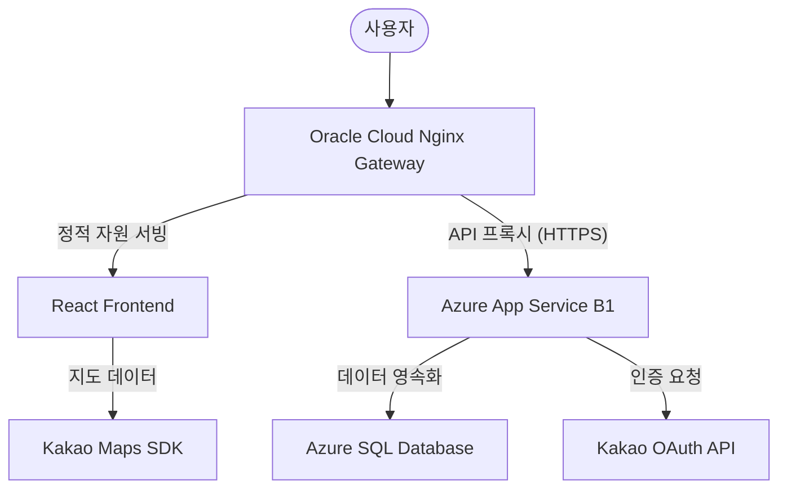

# Gourmet Social (Team 7)
지능형 맛집 투표 플랫폼

---

## 1. 프로젝트 멤버 및 역할
- **박혜성**: **프론트엔드 및 인프라 아키텍처 총괄**.
- **전동훈**: **백엔드 및 인증 시스템 개발**.
- **박소영**: **백엔드 비즈니스 로직 및 DB 설계**.

## 2. 프로젝트 소개 및 필요성
본 프로젝트는 메뉴 결정에 어려움을 겪는 현대인들을 위해, 모임 구성원들이 쉽고 재미있게 메뉴를 정할 수 있도록 돕는 **실시간 투표 플랫폼**입니다.
- **필요성**: 기존 메신저 투표의 텍스트 기반 한계를 극복하고, 지도를 기반으로 한 시각적 정보와 재미있는 인터랙션(스와이프)을 결합하여 의사결정 효율을 높이고자 합니다.

## 3. 관련 기술 및 시장 조사
- **Azure PaaS**: 서버 관리 부담을 줄이고 자동 확장이 가능한 App Service와 SQL Database 활용.
- **OAuth 2.0**: 소셜 로그인(카카오)을 통한 사용자 편의성 극대화 및 보안성 확보.
- **API-First Design**: OpenAPI(Swagger) 명세를 우선 확립하여 프론트-백엔드 병렬 개발 생산성 확보.

## 4. 개발 결과물 소개 (Architecture)

### 아키텍처 다이어그램

- **Gateway**: Oracle Cloud (Nginx) - 도메인 및 SSL 관리.
- **Backend**: Azure App Service (Java Spring Boot, B1 Tier).
- **Database**: Azure SQL Database (Serverless).
- **아키텍처 강점**: 단일 도메인(Nginx)을 통해 CORS 문제를 해결하고, 핵심 로직은 Azure의 강력한 PaaS 기능을 활용함.

## 5. 사용 방법 (설치 및 실행)
### 온라인 접속
- **[PROD] 프로덕션 주소**: [https://pnu-team7-prod.duckdns.org](https://pnu-team7-prod.duckdns.org)
- **[STAGE] 스테이징 주소**: [http://pnu-team7-stage.duckdns.org](http://pnu-team7-stage.duckdns.org) (개발 검증용)

### 로컬 실행 방법
1. **Repository Clone**: `git clone https://github.com/pnu-cc-team7/term-proj.git`
2. **Backend**: `cd implementations/server` 이동 후 `./gradlew bootRun`
3. **Frontend**: `cd implementations/client` 이동 후 `npm install && npm run dev`

## 6. 기대 효과 및 활용 방안
- **모임 메뉴 결정**: 점심 식사, 회식 등 다수결이 필요한 모든 상황에서 직관적인 도구로 활용.
- **맛집 데이터 축적**: 투표 결과를 기반으로 특정 지역의 선호 맛집 트렌드 분석 가능.

## 7. AI 활용 사례
- **개발 및 문서화 보조**: GitHub Copilot 및 Gemini CLI를 활용하여 전체 코드 및 문서의 약 35%를 AI 보조로 개발/작성.
- **세부 활용**: 
    - **인프라 자동화**: 복잡한 Nginx 리버스 프록시 설정 및 Azure CLI 명령어 생성 보조를 통해 하이브리드 아키텍처 구축 시간 단축.
    - **로직 최적화**: React 훅 기반의 스와이프 애니메이션 로직 및 백엔드 예외 처리 구조 최적화.
    - **방대한 문서화 관리**: 프로젝트 가이드라인, 인프라 명세서, API 문서 등 다량의 기술 문서 초안 작성 및 구조화 과정에서 AI의 요약 및 편집 도움을 받아 문서 완성도와 일관성을 높임.
    - **테스트 자동화**: 단위 테스트 및 E2E 테스트(Playwright) 시나리오 작성 자동화를 통해 신뢰성 있는 릴리즈 환경 구축.